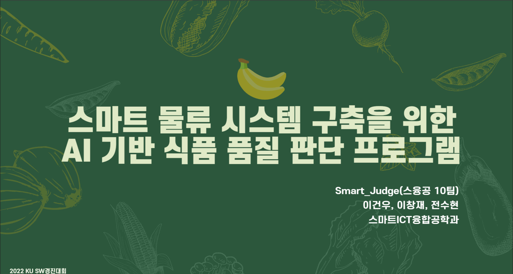

# 🌿 건국대학교 2022년 2학기 졸업 프로젝트

## 스마트 물류 시스템 구축을 위한 AI(CoreML, CNN)기반 신선식품 품질 판단 프로그램
### SW 경진대회 장려상 🏆

* **개발기간: 2022년 09월 - 11월 (2 개월)**
* **개발인원: 3인 (iOS, Server, AI)**
---

---

### 요구사항
 - iOS 16.0 + 
 - Swift 5

### iOS 주요기술
 - UIKit, SwiftUI
 - CoreML
 - AVFoundation
 - Chart(SwiftUI)
 - Coordinator Pattern
 - NSAttributedString
 - NWPathMonitor
 - MVC
 - Alamofire(multipart/form-data), RxSwift, RxCoaoa, SnapKit
 

# 시연영상

#### **🫲🏻 좌측 영상**은 네트워크가 연결된 상태, 

#### **🫱🏻 우측 영상**은 네트워크가 연결되지 않은 상태의 결과물입니다.

 
 

 
